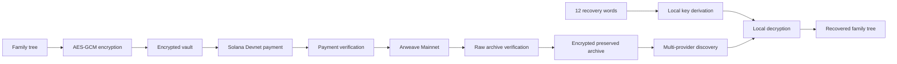

<p align="center">
  
</p>

<p align="center">
  <a href="https://azovskaya.github.io/sejire_arweave_solana/"><strong>Live Protocol</strong></a>
  ·
  <a href="https://azovskaya.github.io/sejire_arweave_solana/#/restore"><strong>Recovery</strong></a>
  ·
  <a href="docs/colosseum/COLOSSEUM_SUBMISSION.md"><strong>Colosseum Submission</strong></a>
  ·
  <a href="https://azovskaya.github.io/sejire_arweave_solana/build-provenance.json"><strong>Build Provenance</strong></a>
</p>

<p align="center">
  <a href="https://github.com/azovskaya/sejire_arweave_solana/actions/workflows/checks.yml">
    
  </a>
  
  
  
</p>

# SEJIRE

**Pay with Solana. Preserve on Arweave. Recover with 12 words.**

SEJIRE is a decentralized protocol for creating, encrypting, preserving, and independently recovering family trees.

A family can build a tree without an account or wallet. When it chooses permanent preservation, SEJIRE encrypts the archive in the browser, verifies the preservation payment through Solana, stores the encrypted archive on Arweave, and allows recovery on a clean device using 12 words.

Rooted in the Kazakh tradition of *shezhire*. Built for families everywhere.

## Working proof

The current pilot completed the full flow:

1. Create a family tree in the browser.
2. Encrypt the family vault locally with AES-GCM.
3. Verify an exact `0.03 SOL` payment on Solana Devnet.
4. Publish the encrypted archive to Arweave Mainnet.
5. Retrieve the raw archive and verify its size, SHA-256 digest, and vault identity.
6. Open SEJIRE in a clean browser.
7. Recover the family tree using only the 12 recovery words.

The admin overview also reads the Arweave save and verifies the finalized Solana payment through public read-only endpoints.

> This proves the technical workflow. It does not yet prove product-market fit, customer traction, or production pricing.

## Why Solana + Arweave

### Solana — practical payment and verification

SEJIRE uses Solana as the payment and coordination layer. It verifies:

- the network;
- transaction finality;
- the payer;
- the recipient;
- the exact amount;
- the deterministic preservation reference;
- the absence of unexpected value transfers.

Family names, dates, relationships, and recovery words are not written to Solana.

### Arweave — encrypted archive storage

Arweave stores the encrypted family archive independently of the SEJIRE interface.

SEJIRE does not mark preservation complete after receiving a transaction ID. It retrieves the raw archive again and verifies its integrity before showing completion.

### Browser cryptography — family-controlled recovery

The archive is encrypted before upload. The 12 recovery words remain with the family and are used locally to derive the decryption key and vault identifier.

## Architecture



Detailed architecture: [docs/colosseum/ARCHITECTURE.md](docs/colosseum/ARCHITECTURE.md).

## Live links

- Protocol: https://azovskaya.github.io/sejire_arweave_solana/
- Recovery: https://azovskaya.github.io/sejire_arweave_solana/#/restore
- Build provenance: https://azovskaya.github.io/sejire_arweave_solana/build-provenance.json
- Colosseum submission text: [docs/colosseum/COLOSSEUM_SUBMISSION.md](docs/colosseum/COLOSSEUM_SUBMISSION.md)
- Demo guide: [docs/colosseum/DEMO_GUIDE.md](docs/colosseum/DEMO_GUIDE.md)
- Prior-work disclosure: [docs/colosseum/HACKATHON_WORKLOG.md](docs/colosseum/HACKATHON_WORKLOG.md)
- Final checklist: [docs/colosseum/SUBMISSION_CHECKLIST.md](docs/colosseum/SUBMISSION_CHECKLIST.md)

## What existed before the hackathon

SEJIRE was an existing genealogy project before Crypto World's Fair. The pre-hackathon project already included:

- the family-tree editor;
- ancestor views;
- PDF and JSON export;
- client-side encryption;
- recovery concepts;
- earlier Arweave and AO experiments.

The original source and exact import baseline are disclosed in [HACKATHON_WORKLOG.md](docs/colosseum/HACKATHON_WORKLOG.md).

## What was built during the hackathon

The hackathon work added and hardened:

- Solana browser-wallet payment;
- deterministic payment references;
- strict finalized-payment verification;
- lost-response reconciliation and duplicate-payment prevention;
- the Preservation V2 state machine;
- real encrypted Arweave Mainnet preservation;
- post-upload raw-data verification;
- clean-browser recovery from 12 words;
- multi-provider and multi-gateway recovery;
- version-head and fork handling;
- password-protected admin diagnostics;
- network-based Arweave and Solana admin overview;
- public deployment, provenance, and browser-test coverage.

Only work completed during the contest period is presented as hackathon work.

## Team and contributors

### Alexey Azovsky — creator, developer, and official team lead

Alexey is an early-career software developer and a student at Tomorrow School. He graduated from the Faculty of Physics and Mathematics at Orenburg State Pedagogical University. He created SEJIRE and leads its product and technical development.

### Alisa Azovskaya — presentation and materials contributor

Alisa is Alexey's daughter. She helped prepare the Colosseum materials and record the English-language pitch and product-demo videos.

For the Colosseum submission, Alexey is the official entrant. Alisa is credited for presentation and materials support and is not listed as an official entrant.

## Run locally

Requirements:

- Node.js `22.12+`
- npm
- Git

```bash
git clone https://github.com/azovskaya/sejire_arweave_solana.git
cd sejire_arweave_solana

npm ci --prefix apps/web
npm ci --prefix apps/sponsor

npm test
npm run lint --prefix apps/web
npm run native:build
npm run dev --prefix apps/web
```

Automated tests use synthetic data and mocked wallets. They do not spend SOL, sign with the owner's wallets, or publish a new family archive.

## Verification

The release gate includes:

- TypeScript and lint;
- unit and protocol tests;
- Solana payment validation;
- Preservation V2 browser tests;
- admin-login browser tests;
- 22 clean-browser recovery scenarios;
- multi-gateway fallback;
- no-wallet/no-write recovery checks;
- public deployment smoke tests;
- build-to-published-SHA provenance.

Technical documentation:

- [Preservation V2](docs/PRESERVATION_V2.md)
- [Resilient recovery ADR](docs/adr/0009-resilient-vault-recovery.md)
- [Solana preservation](docs/SOLANA_PRESERVATION.md)
- [Security policy](SECURITY.md)

## Privacy and current limits

- Draft family data is stored locally in the browser and is not encrypted until the protected archive is created.
- The encrypted payload and limited technical metadata are public on Arweave.
- Solana wallet activity is public; SEJIRE does not claim payment anonymity.
- Losing the 12 recovery words can make the archive impossible to decrypt.
- The current payment uses Solana Devnet and is not production revenue.
- One owner-run pilot proves the technical path, not external demand.
- Shared family access, inheritance recovery, and mainnet settlement remain future work.
- The static admin password gate protects the interface only; wallet signatures remain required for critical wallet operations.

## Repository map

| Path | Purpose |
|---|---|
| `apps/web` | React/TypeScript family-tree client, encryption, payment, preservation, and recovery |
| `apps/sponsor` | Earlier service and checkout components retained for protocol development |
| `packages/checkout` | Payment amounts, orders, and state models |
| `packages/schema` | Family-tree and archive schemas |
| `ao` | Earlier AO protocol experiments |
| `docs/colosseum` | Submission, demo, work-log, and checklist materials |
| `docs/verification` | Reproducible technical evidence |

## License

MIT. See [LICENSE](LICENSE).

---

**SEJIRE — Pay with Solana. Preserve on Arweave. Recover with 12 words.**
