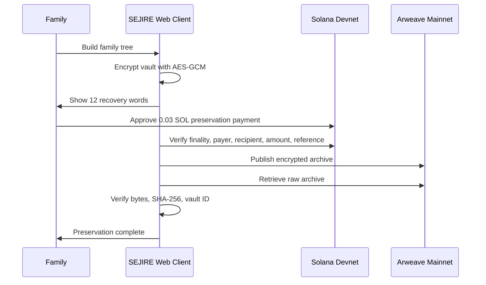
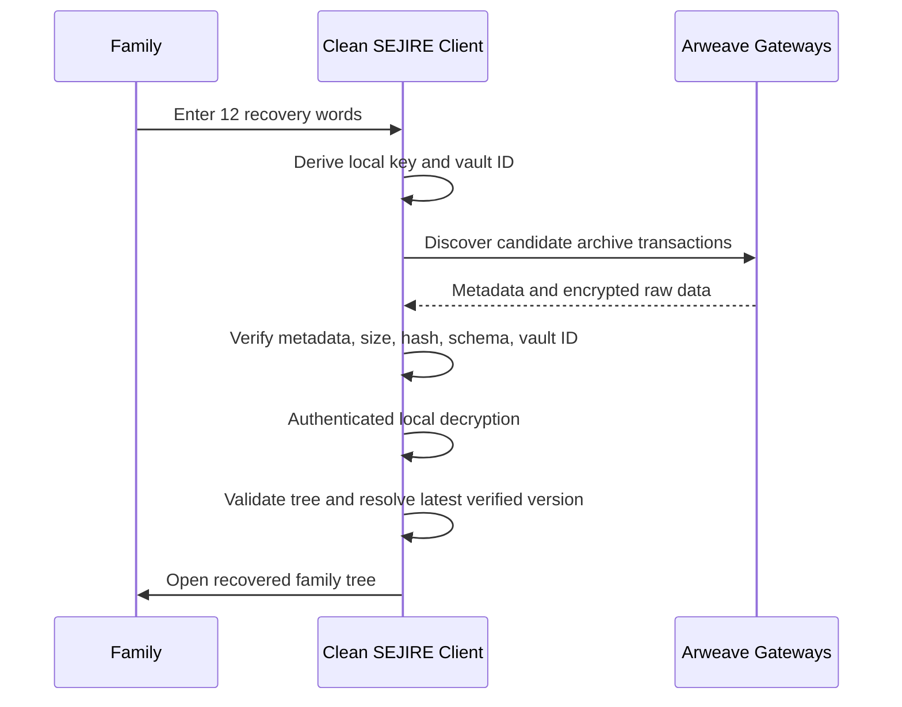

# SEJIRE architecture

## One-sentence design

**Solana verifies the preservation payment, Arweave stores the encrypted archive, and the family keeps the 12 words required to recover it.**

## Preservation flow

## Recovery flow

## Trust boundaries

### The family controls

- the 12 recovery words;
- the decryption key derived locally;
- the plaintext family tree;
- the decision to authorize payment and preservation.

### Solana proves

- a finalized payment exists;
- the expected payer signed;
- the expected service recipient received the exact amount;
- the transaction is linked to the preservation reference;
- no unexpected value transfer was accepted.

### Arweave provides

- the encrypted archive data;
- immutable transaction metadata;
- independent public retrieval paths.

### SEJIRE verifies locally

- archive byte size;
- SHA-256 digest;
- vault identifier;
- envelope schema;
- authenticated decryption;
- family-vault structure;
- latest verified version.

## Data that is public

- Solana payer and recipient addresses;
- payment amount and network fee;
- transaction signatures;
- Arweave transaction IDs;
- archive size;
- encrypted payload;
- limited technical tags and timestamps.

## Data that is not intentionally published as plaintext

- names;
- dates;
- notes;
- family relationships;
- recovery words;
- encryption keys.

## Failure behavior

SEJIRE does not convert uncertainty into success.

- An unavailable Solana RPC does not prove no payment occurred.
- A wallet timeout does not automatically trigger another payment.
- An Arweave transaction ID alone does not prove the archive is correct.
- A gateway failure triggers fallback to another gateway.
- A wrong hash, vault ID, or decryption key rejects the candidate.
- Recovery performs network reads only; it does not connect a wallet or create a payment.
